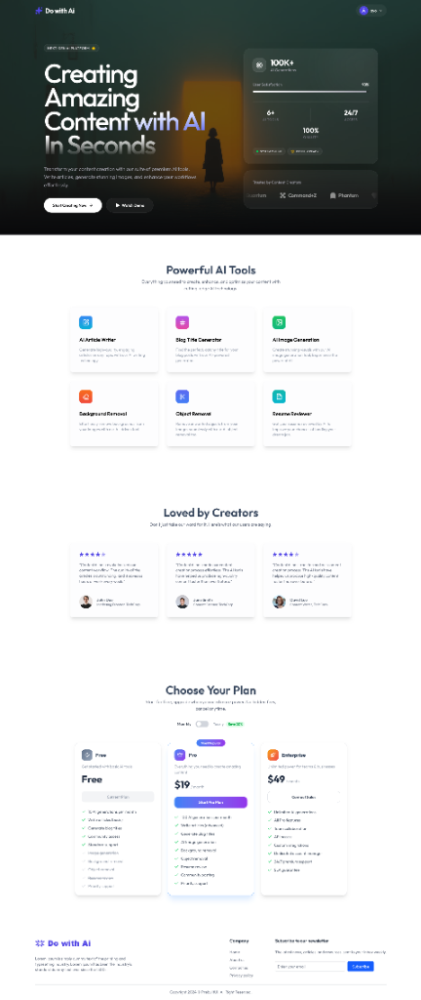
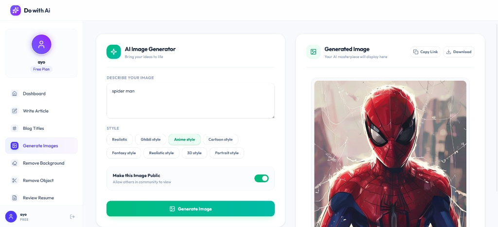

# Do with AI - All-in-One AI SaaS Platform 🚀

A premium, full-stack MERN SaaS application that provides a comprehensive suite of AI-powered productivity and design tools. Built with a stunning, modern dark-themed user interface, Clerk authentication, Stripe subscription plans, and advanced AI integrations.

---

## 📸 Screenshots

### Landing Page


### User Dashboard & AI Image Generator


---

## 🛠️ Features & AI Tools

### 1. 🔑 User Authentication & Management
*   **Secure Authentication:** Powered by **Clerk** (Sign In, Sign Up, Profile Management).
*   **User Context:** Custom `AuthContext` managing user profiles, subscription plans, and generation quotas.

### 2. 💳 Stripe Subscription System
*   **Pricing Plans:** Free, Pro ($19/mo), and Enterprise ($49/mo) plans.
*   **Stripe Checkout:** Seamless integration with Stripe to upgrade users to Premium plans.
*   **Webhook Integration:** Automatic webhook listeners to update user subscription status in the database upon successful payments.

### 3. 🎨 Creative & Design AI Tools
*   **AI Image Generator:** Generate high-quality, stylized images using text prompts. Supports multiple styles (Realistic, Ghibli, Anime, Cartoon, Fantasy, 3D, Portrait).
*   **Background Removal:** Instantly remove backgrounds from images, making them transparent.
*   **Object Removal:** Erase unwanted objects or people from photos using smart AI inpainting.

### 4. ✍️ Content & Writing AI Tools
*   **AI Article Writer:** Generate long-form, structured, and SEO-optimized articles based on topics and length parameters.
*   **Blog Title Generator:** Create catchy, high-converting blog titles and headlines for multiple categories.
*   **Resume Reviewer (CV):** Upload PDF resumes to get instant, AI-powered feedback, strengths, and areas of improvement.

---

## 💻 Tech Stack

### Frontend
*   **React (Vite):** Fast, modern single-page application framework.
*   **Tailwind CSS (v4):** Premium custom styling using modern CSS variables and utility classes.
*   **Lucide React:** Icon library for clean and consistent UI iconography.
*   **Clerk React:** Client-side authentication wrapper.
*   **React Router DOM:** Declarative client-side routing.

### Backend
*   **Node.js & Express:** Lightweight, fast, and scalable backend server.
*   **MongoDB & Mongoose:** NoSQL database to store user records, AI creations, and transaction history.
*   **Stripe SDK:** Server-side payment processing and webhook handling.
*   **Google Gemini AI API:** Powers the Article Writer, Blog Title Generator, and Resume Reviewer.
*   **ClipDrop / Stability AI API:** Powers the Image Generation, Background Removal, and Object Removal tools.
*   **Multer:** Middleware for handling `multipart/form-data` file uploads (resumes and images).

---

## 📂 Project Structure

```text
MERN-AI/
├── client/                 # Frontend React Application
│   ├── src/
│   │   ├── components/     # Reusable UI components (Navbar, Sidebar, Hero, Plan, etc.)
│   │   ├── context/        # React Context (AuthContext for user state)
│   │   ├── pages/          # Page components (Dashboard, GenerateImage, ReviweCV, etc.)
│   │   ├── index.css       # Global styles & Tailwind directives
│   │   └── main.jsx        # App entry point
│   ├── vercel.json         # Vercel deployment configuration
│   └── vite.config.js      # Vite configuration
│
└── server/                 # Backend Node.js API
    ├── controllers/        # Route controllers (AI processing, user profile, etc.)
    ├── models/             # Mongoose database schemas (User, Creation)
    ├── routes/             # Express API routes
    ├── server.js           # Server entry point
    └── vercel.json         # Vercel deployment configuration
```

---

## ⚙️ Local Installation & Setup

Follow these steps to run the project locally:

### 1. Clone the Repository
```bash
git clone https://github.com/melan-Akash/MERN-AI-website.git
cd MERN-AI-website
```

### 2. Configure the Backend (`/server`)
1. Navigate to the server directory:
   ```bash
   cd server
   npm install
   ```
2. Create a `.env` file in the `server` directory (do not commit this file to Git):
   ```env
   PORT=5000
   MONGODB_URI=your_mongodb_connection_string
   JWT_SECRET=your_jwt_secret
   CLOUDINARY_CLOUD_NAME=your_cloudinary_name
   CLOUDINARY_API_KEY=your_cloudinary_key
   CLOUDINARY_API_SECRET=your_cloudinary_secret
   EMAIL_USER=your_gmail_address
   EMAIL_PASS=your_gmail_app_password
   GEMINI_API_KEY=your_gemini_api_key
   OPENROUTER_API_KEY=your_openrouter_api_key
   STRIPE_SECRET_KEY=your_stripe_secret_key
   ```
3. Start the backend server:
   ```bash
   npm run server
   ```

### 3. Configure the Frontend (`/client`)
1. Navigate to the client directory:
   ```bash
   cd ../client
   npm install
   ```
2. Create a `.env` file in the `client` directory:
   ```env
   VITE_CLERK_PUBLISHABLE_KEY=your_clerk_publishable_key
   ```
3. Start the frontend development server:
   ```bash
   npm run dev
   ```

---

## 🚀 Deployment Guide

### Backend Deployment (Render / Railway)
1. Push your code to GitHub.
2. Create a new **Web Service** on [Render](https://render.com/).
3. Connect your repository, set the **Root Directory** to `server`, and set the Start Command to `node server.js`.
4. Add all environment variables from `server/.env`.
5. Deploy and copy your backend URL.

### Frontend Deployment (Vercel)
1. Create a new project on [Vercel](https://vercel.com/).
2. Import your repository, set the **Root Directory** to `client`, and set the Framework Preset to `Vite`.
3. Add your `VITE_CLERK_PUBLISHABLE_KEY` and any backend API URL environment variables.
4. Deploy!
